# See My Trip
See My Trip is a website that aims to inspire would-be roadtrippers or holiday tourers. Users can register as Voyagers by creating a profile, allowing them to post a planned trip giving details of when and where they'll be going and their mode of transport. Other users can follow the trip and comment - either to give recommendations for stops or just to show their enthusiasm.

Voyagers can post trip journal updates, which appear linked to the relevant trip and allow other site users to see how their trip is going. The live link is here: [See My Trip](https://seemytripcapstone-0e4622862850.herokuapp.com/).

<!-- Mock-up here -->

## Table of Contents

# UX Design
## Site Goals
The site aims to inspire users to explore the world and embark on adventures by allowing them to see what others have done or are planning on doing.

It aims to allow users to help each other to have the best experience of their adventures by pooling their knowledge and experience.

## Agile Planning
This project was developed using an agile methodology, getting a working site in place first with all key user stories covered before adding further features and functionality.

MoSCoW prioritisation was used to sort the identified user stories into sprints based on importance to the initial MVP site.

GitHub projects was used for the project board, which can be found [here](https://github.com/users/alphabetjim/projects/8/views/1?visibleFields=%5B%22Title%22%2C%22Assignees%22%2C%22Status%22%2C%22Labels%22%2C%22Milestone%22%5D). A screenshot of the board can be seen below.

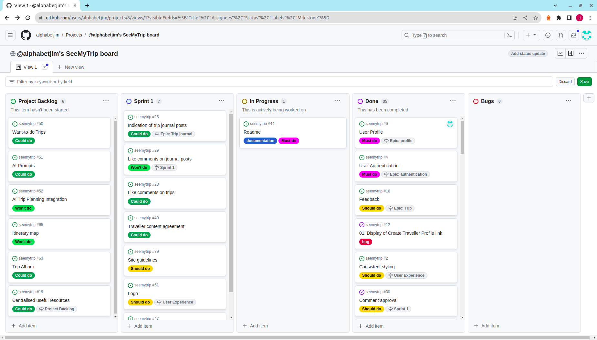

## Epics 
The User Stories within this project can be split into several epics:

### Authentication
This entails everything to do with the implementation of authentication on the site.
#### User Stories:
- As a user I can log in so that I can upload my own trip ideas and comment on others.
- As a site owner I can prevent unauthorised access to private pages so that Traveller profiles and trip edit/delete access cannot be gained through simply entering the URL.

#### Features:
The allauth package was used to implement authentication for this site, and the templates that come with it were adapted to fit the site theme. 
The Site landing page gives users links to sign up or log in, as well as to view all trips and voyagers already on the site:
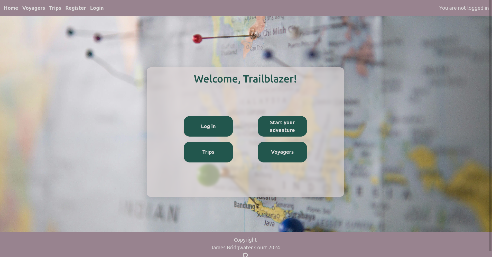

However, without logging in they are unable to follow or leave a comment on any trips.
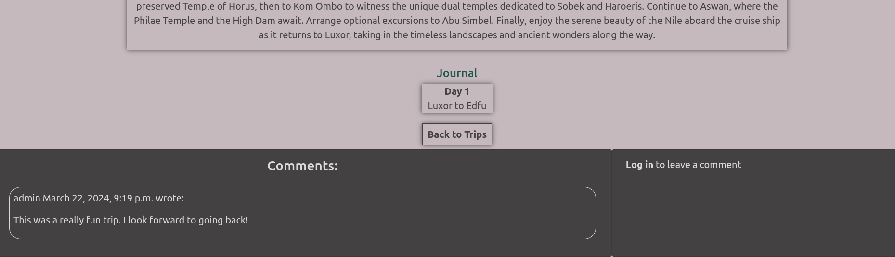
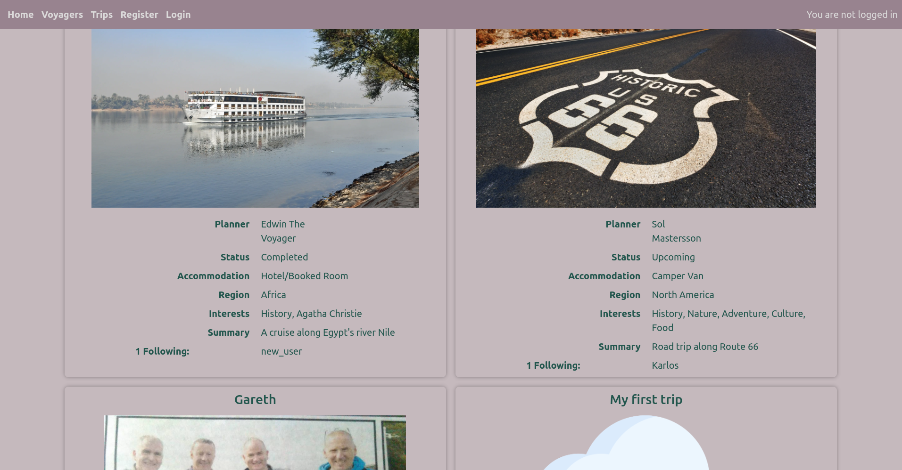

Users are able to sign up, or log in.
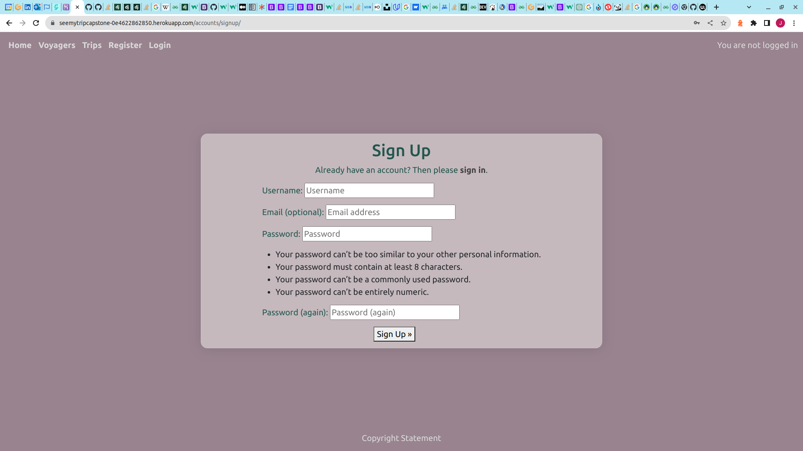
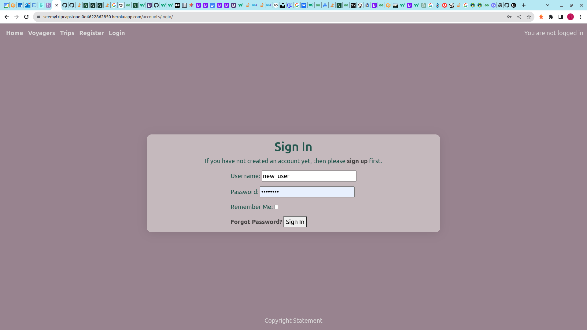

Once signed in, they are able to follow & comment on trips.
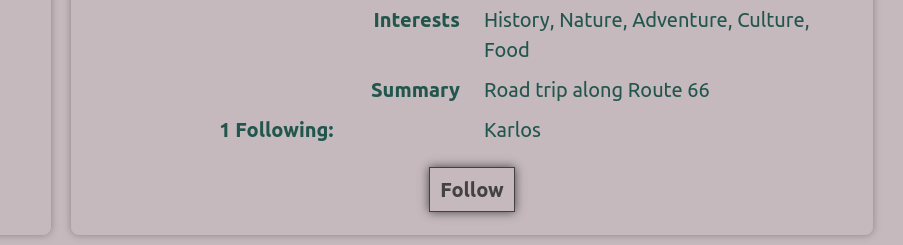
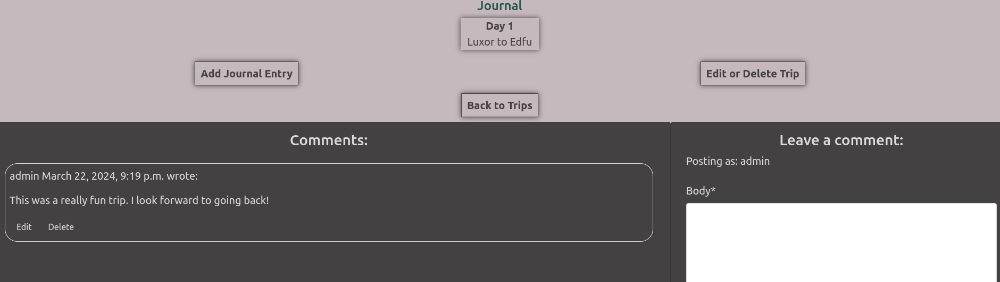

Alongside view security against attempts by unauthorised users to gain edit access through simply entering the URL, these features meet the user story requirements defined for this epic.
### Profile
This covers all aspects of the profile component of the site, including allowing user CRUD functionality.
#### User Stories:
- As a Site User I can create a user profile so that I can store my preferences and planned trips.
- As a user I can upload images for my profile, trips and journal posts so that other users can have a richer understanding of the content.
- As a user I can view the profile of each traveller so that I can see more information about them and the trips that they are planning.
- As a traveller I can view the trips that I have planned so that I can see what's coming up, enjoy the memories and post updates on current trips.

#### Features:
- Once registered, users can create their profile:
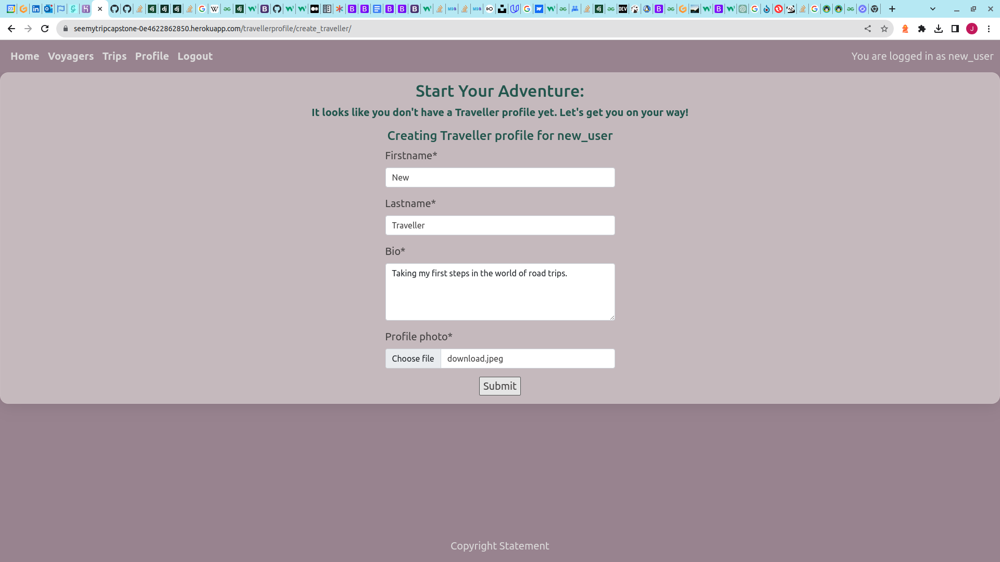
- Update & delete functionality are available to the logged-in user only on their own profile:
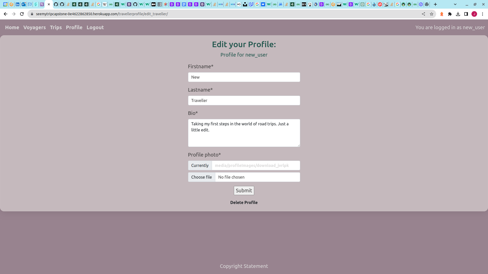
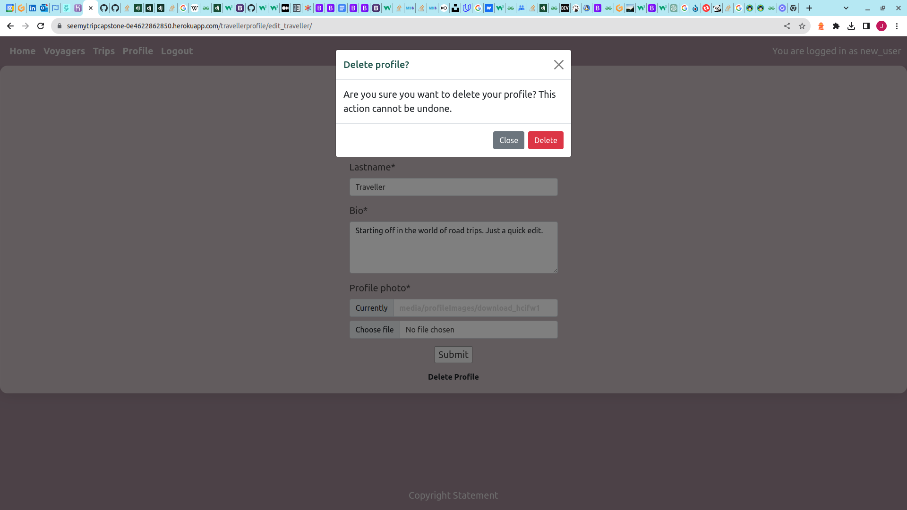
- Users are also able to view other travellers' profiles linked from the Voyagers page:
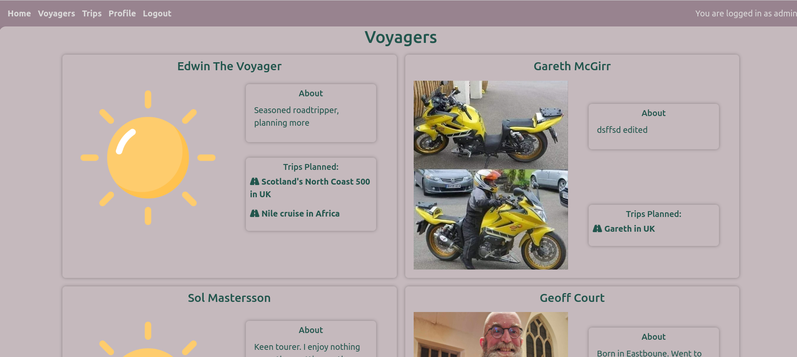
- Users can view travellers' planned trips on their respective profile pages, and can click to create a new trip when on their own.
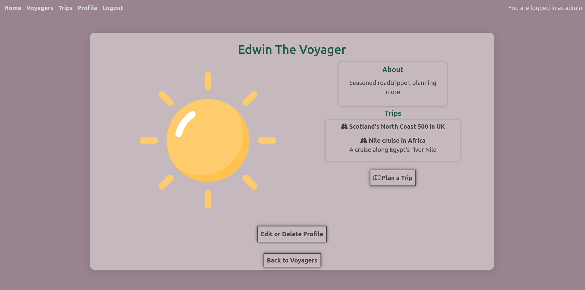 

### Trip
This deals with creating, updating and deleting trip plans as well as viewing those of other members of the community.
#### User Stories:
- As a user I can create a post about my trip so that other users can follow it and give recommendations.
- As a user I can comment on other users' trips so that I can suggest destinations or activities.
- As a visitor I can see a page containing all planned trips so that I can be inspired to join and maybe create my own.
- As a traveller I can easily specify the dates of my trip so that I can have a positive user experience.
#### Features
- As mentioned above, users can create a new trip from their profile page. These can also be edited by the user that created them using a link on the trip detail page. It is straightforward to add a photo and pick dates within the form.
    - As with user profiles, the edit/delete links are only available to trips' creators.
    - The same is true of the button to create a new journal entry for the trip.
    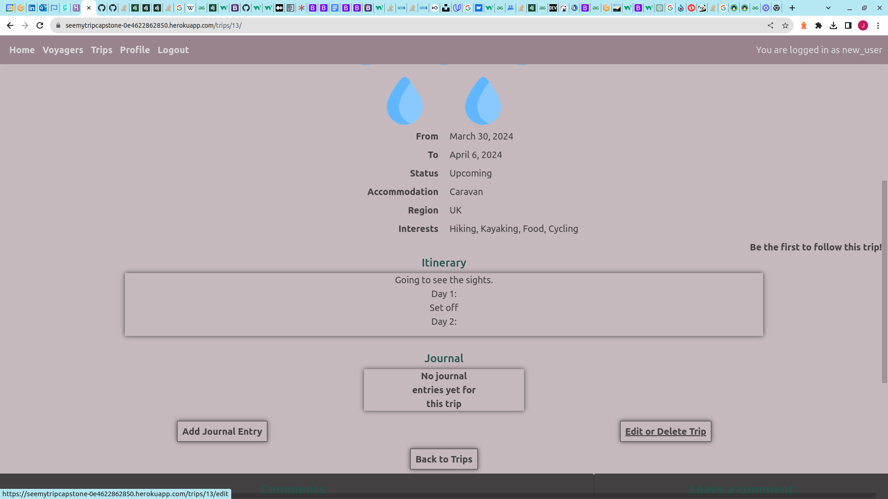
- Users can comment on their or other users' trips using the provided comment form.
    

### Trip Journal
The creation of journal posts to update other users on trip progress, and to help cement memories in place.
#### User Stories:
- As a user I can add journal-style posts documenting my trip so that other users can benefit from my experience.
#### Features:
- By clicking the 'Add Journal Entry' button on any of their trip pages (see image above), logged-in users can create a journal post to describe a day on that trip. Again, these include an image upload field to allow for memories of the day to be added.

### User Experience
This encompasses the responsive, user-friendly design of the site as well as feedback and error handling.
#### User Stories:
- As a site user I can see the content arranged logically on each page so that gain the full benefit of the material being presented.
- As a site viewer I can see information presented in an appropriate font/set of fonts so that I can have a positive user experience.
- As a site user I can receive feedback on the site so that I can be sure of having created/edited/deleted my traveller profile.
- As a user I can be prompted to confirm deletion of profiles and trips so that I can understand that deletion is irreversible.
- As a user I can see consistent styling across all pages of the site so that I can have a positive user experience.
- As a user I can identify the site's browser tab so that I can easily get back to it.
- As a user I can see an error page that redirects me back to the site if there is a problem so that I can have a positive user experience.
#### Features:
- 

# Wireframes

# Database Structure

# Surface Design

## Font
The [Cabin](https://fonts.google.com/specimen/Cabin) font was chosen for this site, both as a close approximation to the Transport font used on UK road signs and because it is an easily legible, user-friendly font.

# Technologies

# Testing
[TESTING.md](TESTING.md)

# Deployment

# Credits

## Similar Sites
[Travellers point](https://www.travellerspoint.com/forum.cfm).
[Epic Trips](https://www.epic-trips.com/) uses AI to create custom trips.
[Roadtrippers](https://roadtrippers.com/)
## Images
Favicon image photo by [Jack Ward]("https://unsplash.com/@jackward?utm_content=creditCopyText&utm_medium=referral&utm_source=unsplash") on [Unsplash]("https://unsplash.com/photos/asphalt-road-between-pine-trees-1sddRcdi5Ns?utm_content=creditCopyText&utm_medium=referral&utm_source=unsplash")

Error page photo by [Nico Smit]("https://unsplash.com/@nicosmit99?utm_content=creditCopyText&utm_medium=referral&utm_source=unsplash") on [Unsplash]("https://unsplash.com/photos/a-yellow-road-closed-sign-sitting-on-the-side-of-a-road-MWKQ8jsnid0?utm_content=creditCopyText&utm_medium=referral&utm_source=unsplash")
  
Home page background photo by [Z]("https://unsplash.com/@dead____artist?utm_content=creditCopyText&utm_medium=referral&utm_source=unsplash") on [Unsplash]("https://unsplash.com/photos/world-map-with-pins-TrhLCn1abMU?utm_content=creditCopyText&utm_medium=referral&utm_source=unsplash").
    

Image of Gorges de Verdon from https://www.jadescapades.com/moustiers-sainte-marie-and-the-lac-de-sainte-croix/
North Coast 500 image from https://en.wikipedia.org/wiki/North_Coast_500
<!-- Home page background from https://www.serre-chevalier.com/en/domaine-altitude/domaine-serre-chevalier-ete -->
Landscapes used as backgrounds copyright Jazzmin Watson.