## Functional Testing
### User Stories
- User Sign up, login and logout
    - As a site viewer I can log in so that I can upload my own trip ideas and comment on others.

        Success Criteria

        - Users can register and log in/out.
        - Access to user profile is only possible for the logged-in user that owns the page.

    - The user can register and log in and out.
    - Access to a user's profile page is view-only, with only the authorised user having access to update/delete functionality.

- User Profile
    - As a Site User I can create a user profile so that I can store my preferences and planned trips.

        Success Criteria

        - User can register & input values for profile fields
        - User can view and edit profile
        - User can also delete profile
    
    - Registered users can create a profile to enable the desired functionality
        - This profile can be updated and deleted by the user.

- Post a Trip
    - As a user I can create a post about my trip so that other users can follow it and give recommendations.

        Success Criteria

        - Logged-in user with traveller profile can create a trip and give details of destination, accommodation type, etc.
        - Logged-in users can click to follow.

    - Once a user has created a traveller profile they are able to create, update or delete a trip.
    - Other users can click to follow this trip.

- Comment on a Trip
    - As a user I can comment on other users' trips so that I can suggest destinations or activities.

        Success Criteria

        - Logged-in user can comment on a trip
        - User can edit & delete comments that they have made

    - The detail page for each trip displays any comments that have been made on it, alongside a form that registered users can use to add comments.
    - The user who has made a comment is able to edit and delete it, while these controls are hidden for other users.
    - Comment form is not displayed the user is not logged in.

- Image Upload
    - As a user I can upload images for my trips and journal posts so that other users can have a richer understanding of the content.

        Success Criteria

        -Users are able to upload photos in a clear and comprehensible manner, either within the trip/post creation form or in a logical way.

    - Users can include a photo when creating their profiles, trips or journal posts. 
    - Users can update the image used when updating the relevant item.
                
- Feedback
    - As a site user I can receive feedback on the site so that I can be sure of having created/edited/deleted my traveller profile.

        Acceptance Criteria

        - Messages display when user carries out actions that modify anything within the database

    - This functionality is implemented with Django's built-in messages, providing feedback to the user for CRUD and follow/unfollow operations.

- Trip List
    - As a visitor I can see a page containing all planned trips so that be inspired to join and maybe create my own.

        Acceptance Criteria

        -All trips displayed on an easily accessible page.
        -Logged-in users can follow trips

    - This functionality is accessed via the trips link in the nav bar, which is always visible.
    - Each trip is displayed with a follow button which toggles to reflect whether authenticated user is following it.
    - The follow button is not displayed to the trip's planner.

- Comment Approval
    - As a site administrator I can approve/hide comments that breach guidelines so that site users have a positive experience.

        Acceptance Criteria

        - Approved field on TripComment model
        - Conditional display of comments based on the value of this field.

    - Approved field on TripComment model allows administrators to hide comments that are inappropriate.
    - Conditional display logic implements this on detail page for each trip.

- View all Travellers
    - As a user who does not have a traveller profile I can view a list of all travellers so that I can be inspired to plan my own trip.

        Success Criteria

        - Registered users who have not yet created a traveller profile (as well as travellers) can view a page containing a summary of each traveller, including any trips that they might have planned.

    - This functionality is available on the Voyagers page, accessible via a nav bar link. 
    - This page contains links to a profile page for each traveller, including any trips that they have planned.

- Indication of Trip Status
    - As a viewer I can see whether trips are upcoming, underway or completed so that I can understand what stage they are at.

        Acceptance Criteria

        -Trip list page should display status of trip based on dates entered during trip creation process.

    - Functionality implemented using model properties that are accessed within the template to indicate status.

- Error Pages
    - As a user I can see an error page that redirects me back to the site if there is a problem so that I can have a positive user experience.

        Acceptance Criteria

        - Create 404 error page that links back to site pages
        - Any other error pages likewise.

    - 404 and 500 error pages created and integrated into the site.

## Validator Testing

### HTML
All pages were run through the [HTML Validator](https://validator.w3.org/#validate_by_input). This had to be done using the direct input method due to the presence of Django template tags within the html files, by pasting in the HTML shown by right-clicking and selecting "inspect source".

After resolving some simple unclosed script tag errors and fixing the approach used to implement trip comment update and delete functionality, which had initially used a button 'type' attribute, almost all pages passed showing no errors. 

The only exceptions to these were within packages used to develop the website:
- Crispy-Forms: the Trip, Traveller and TripDay models' edit pages  failed due to this package adding a 'type' attribute to textareas displayed in the form for models.CharField fields.
- allauth: the signup page failed due to stray tags and unclosed elements within the signup form, contained within the package.

### CSS
The stylesheet created for this website was passed through the [CSS Validator](https://jigsaw.w3.org/css-validator/#validate_by_input), and no errors were found.

### Python
The Python code written for the models and views files within each app on this project was passed through a [Python Checker](https://www.pythonchecker.com/) to show any errors or non-conformance with the PEP 8 style guide. The views files were all 100% compliant, and models needed only the addition of spaces around operators.

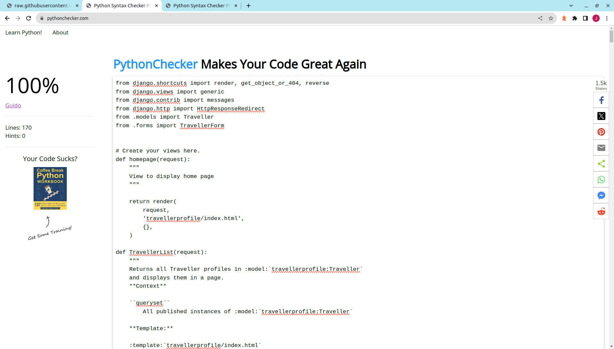

### JavaScript
The JavaScript files written for this website were passed through [jshint](https://jshint.com/) and found to contain no errors, with only advisory warnings about syntax available in ES6 being displayed. An example can be seen below.

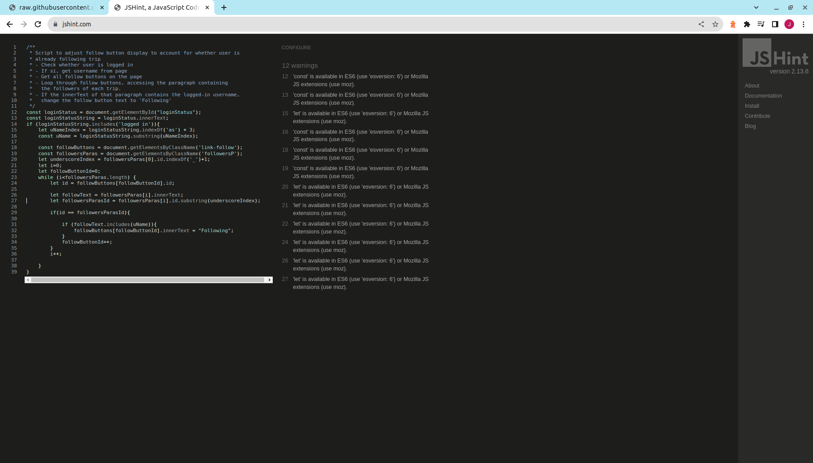

## Lighthouse

The Lighthouse report showed areas for improvement on SEO and Accessibility. As a result the secondary font color was changed to improve contrast and a meta tag was added to describe the site content. There was some range between the different pages on the site for the performance score due to image loading, however all came in as acceptable. The best and worst reports are shown below.

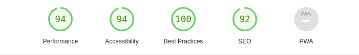

## Responsiveness

The responsiveness of all pages was tested to ensure that the website was accessible to users on a range of devices. This was carried out using the following steps:

- Navigate to [See My Trip](https://seemytripcapstone-0e4622862850.herokuapp.com/)
- Open developer tools (right click -> inspect)
- Set width adjustment pane to responsive and decrease width to smallest (less than 400px)
- Set zoom to 50%
- Drag window to full width and back.

The website should be responsive across all screen sizes, with no images exhibiting any pixelation or distortion. Elements should not overlap, and no horizontal scroll should be present.

The result of this testing was as expected, and can be seen in the GIFs below. The website was also examined in Firefox on a Samsung Galaxy S20+ and performed in line with expectations.

### Results
Home Screen:

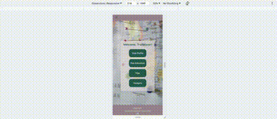

Trips:

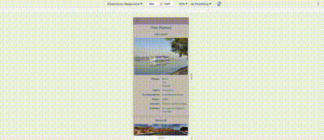

Voyagers:

Trip Page:

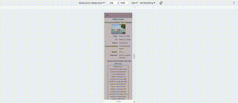

Profile Page:

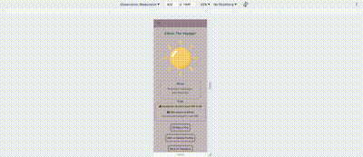

Journal Entry Page:

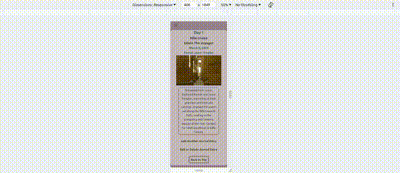

Trip Form:

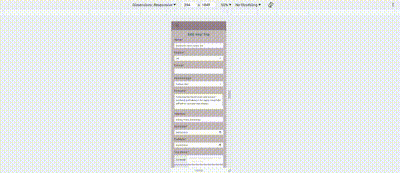

Profile Form:

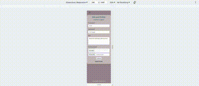

Journal Entry Form:

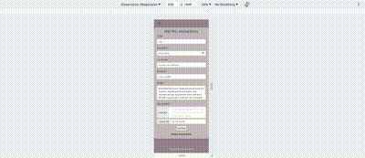

## Browser Compatibility
The website was tested on three different browsers as shown below, and displayed well in each. In Firefox the responsivity was affected slightly on the home screen, with some element overlap between approximately 600-1000px screen width. This is a bug that will be addressed at a later stage.