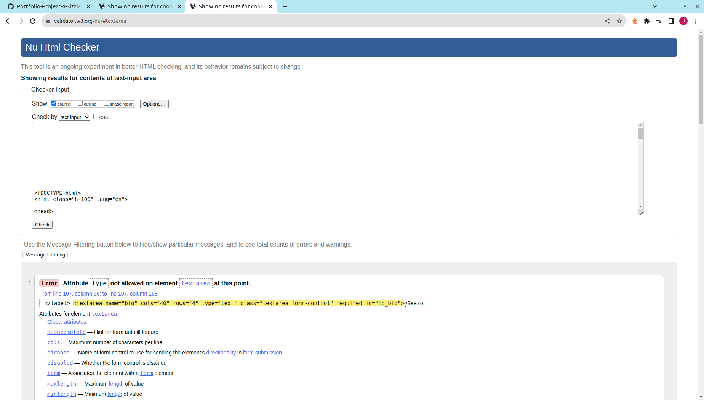
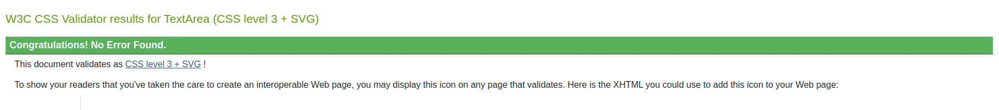

## Functional Testing

## Validator Testing

### HTML
All pages were run through the [HTML Validator](https://validator.w3.org/#validate_by_input). This had to be done using the direct input method due to the presence of Django template tags within the html files, by pasting in the HTML shown by right-clicking and selecting "inspect source".

After resolving some simple unclosed script tag errors and fixing the approach used to implement trip comment update and delete functionality, which had initially used a button 'type' attribute, almost all pages passed showing no errors. 

The only exceptions to these were within packages used to develop the website:
- Crispy-Forms: the Trip, Traveller and TripDay models' edit pages  failed due to this package adding a 'type' attribute to textareas displayed in the form for models.CharField fields.
- allauth: the signup page failed due to stray tags and unclosed elements within the signup form, contained within the package.

### CSS
The stylesheet created for this website was passed through the [CSS Validator](https://jigsaw.w3.org/css-validator/#validate_by_input), and no errors were found.

